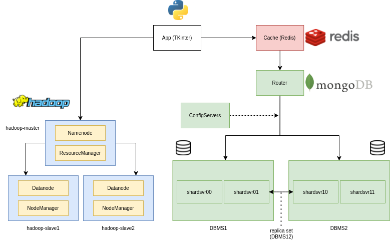

# THU DDBS Final Project

This repository regards our final project for the Distributed Database Systems 2023 course @ HSE University.


## Overview

Distributed Database Systems have become the dominant data management tool for Big Data. Since it is the main purpose of this course project, we have built a Distributed Database System using MongoDB to store the given structured data, from a fictitious online library, and Hadoop Distributed File System for the remaining and unstructured data. Furthermore, we developed a simple TKinter application, in order to combine everything together in a single interactive UI, and a data cache using Redis, as similar requests to the database may happen. Every component of our architecture is running on a different Docker container, with the intention of simulating a distributed environment.

The following figure describes the interaction of components within the architecture:



## Repository organization
The repository is organized in the following 6 main folders:

```
├── app                         # Tkinter app implementation
├── data-generation             # Data generation files (MongoDB or MySQL)
├── docs                        # Project report, manual and useful figures
├── hadoop                      # HDFS containerized configuration
├── mongodb                     # MongoDB Cluster implementation
│   ├── configsvrs              # MongoDB Configuration Servers implementation
│   ├── router                  # MongoDB Query Router implementation
│   └── shards                  # MongoDB Shards implementation
└── redis_cache                 # Redis cache implementation and commands
```

## Built With

- [Docker](https://docs.docker.com/) (Component Containerization)
- [MongoDB](https://docs.mongodb.com/manual/sharding/) (MongoDB Sharded Cluster)
- [Hadoop](https://hadoop.apache.org/docs/r1.2.1/hdfs_design.html) (Hadoop Distributed File System)
- [Redis](https://redis.io/topics/client-side-caching) (Client side caching)
- [TKinter](https://docs.python.org/3/library/tkinter.html) (Simple Python app for interaction)
